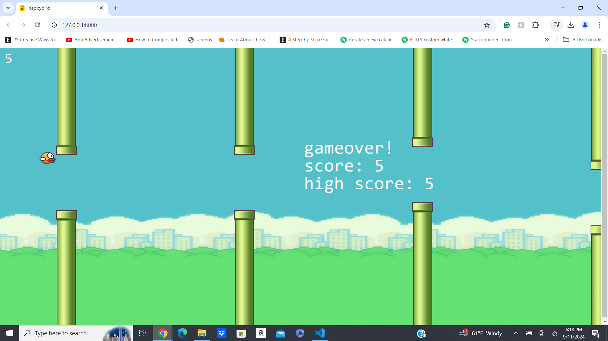

# Happybird
Happybird is a simple 2D game built with JavaScript and Kaboom.js. The objective of the game is to control a bird and navigate it through obstacles by pressing the spacebar to make the bird jump. It's a fun and addictive game with straightforward mechanics!

# Screenshot

# Features
2D side-scrolling game
Simple controls: press space to jump
Built with Kaboom.js and JavaScript
Endless gameplay
Getting Started
Prerequisites
Before you begin, ensure you have the following installed:

Node.js (v14 or higher)
Installation
Clone the repository:

bash
Copy code
npm install
Running the Game
Start the development server:

bash
Copy code
npm run dev
Open your browser and navigate to the provided localhost URL (typically http://localhost:8000).

Press the spacebar to start the game and control the bird.

# Controls
Spacebar: Jump
# Built With
Kaboom.js - A game programming library that helps you make games fast and fun.
JavaScript

# Link
https://siddz415.github.io/Happybird/